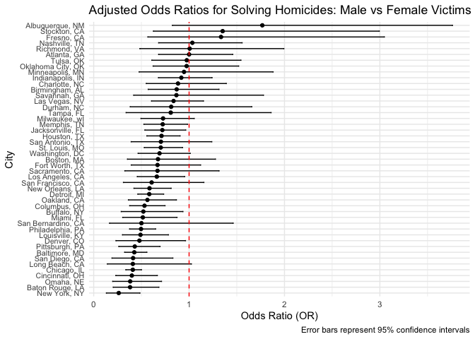
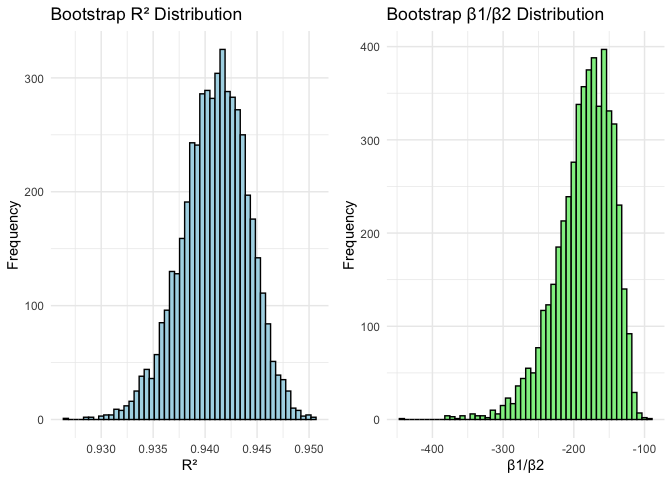
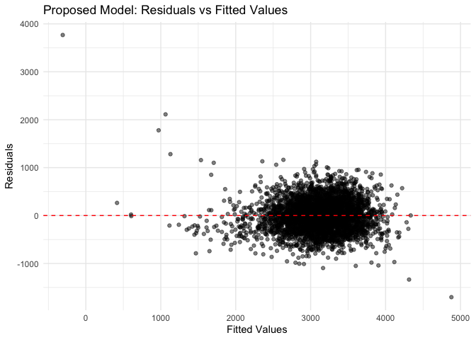

p8105_hw6_fx2212
================
Fenglin Xie
2025-11-16

``` r
library(tidyverse)
```

    ## ── Attaching core tidyverse packages ──────────────────────── tidyverse 2.0.0 ──
    ## ✔ dplyr     1.1.4     ✔ readr     2.1.5
    ## ✔ forcats   1.0.1     ✔ stringr   1.5.2
    ## ✔ ggplot2   4.0.0     ✔ tibble    3.3.0
    ## ✔ lubridate 1.9.4     ✔ tidyr     1.3.1
    ## ✔ purrr     1.1.0     
    ## ── Conflicts ────────────────────────────────────────── tidyverse_conflicts() ──
    ## ✖ dplyr::filter() masks stats::filter()
    ## ✖ dplyr::lag()    masks stats::lag()
    ## ℹ Use the conflicted package (<http://conflicted.r-lib.org/>) to force all conflicts to become errors

``` r
library(readr)
library(modelr)
library(p8105.datasets)
library(knitr)
```

# Problem 1

## Data cleaning and preparation

``` r
homicide_data = read_csv("homicide-data.csv") 
```

    ## Rows: 52179 Columns: 12
    ## ── Column specification ────────────────────────────────────────────────────────
    ## Delimiter: ","
    ## chr (9): uid, victim_last, victim_first, victim_race, victim_age, victim_sex...
    ## dbl (3): reported_date, lat, lon
    ## 
    ## ℹ Use `spec()` to retrieve the full column specification for this data.
    ## ℹ Specify the column types or set `show_col_types = FALSE` to quiet this message.

``` r
homicide_clean = homicide_data |> 
  mutate(
    city_state = str_c(city, ", ", state),
    resolved = as.numeric(disposition == "Closed by arrest"),
    victim_age = as.numeric(victim_age)
  ) |> 
  filter(
    !city_state %in% c("Dallas, TX", "Phoenix, AZ", "Kansas City, MO", "Tulsa, AL"),
    victim_race %in% c("White", "Black")
  ) |> 
  drop_na(victim_age)
```

    ## Warning: There was 1 warning in `mutate()`.
    ## ℹ In argument: `victim_age = as.numeric(victim_age)`.
    ## Caused by warning:
    ## ! NAs introduced by coercion

## Fit logistic regression for Baltimore, MD

``` r
baltimore_data = homicide_clean |> 
  filter(city_state == "Baltimore, MD")

baltimore_fit = glm(resolved ~ victim_age + victim_sex + victim_race, 
                     data = baltimore_data, 
                     family = binomial())

baltimore_results = baltimore_fit |> 
  broom::tidy(conf.int = TRUE) |> 
  filter(term == "victim_sexMale") |> 
  mutate(
    OR = exp(estimate),
    CI_lower = exp(conf.low),
    CI_upper = exp(conf.high)
  )

baltimore_or = baltimore_results |> pull(OR) |> round(3)
baltimore_ci_lower = baltimore_results |> pull(CI_lower) |> round(3)
baltimore_ci_upper = baltimore_results |> pull(CI_upper) |> round(3)
```

For Baltimore, MD, the adjusted odds ratio for solving homicides
comparing male to female victims is 0.426 (95% CI: 0.324, 0.558).

## Fit models for all cities and extract ORs and CIs

``` r
model_fit = function(input_data) {
  glm(resolved ~ victim_age + victim_sex + victim_race, 
                     data = input_data, 
                     family = binomial())
}

city_models = homicide_clean |> 
  nest(data = -city_state) |> 
  mutate(
    models = map(data, model_fit),
    results = map(models, ~broom::tidy(.x, conf.int = TRUE))
  ) |> 
  unnest(results) |> 
  filter(term == "victim_sexMale") |> 
  mutate(
    OR = exp(estimate),
    CI_lower = exp(conf.low),
    CI_upper = exp(conf.high),
    city_state = fct_reorder(city_state, OR)
  )
```

    ## Warning: There were 43 warnings in `mutate()`.
    ## The first warning was:
    ## ℹ In argument: `results = map(models, ~broom::tidy(.x, conf.int = TRUE))`.
    ## Caused by warning:
    ## ! glm.fit: fitted probabilities numerically 0 or 1 occurred
    ## ℹ Run `dplyr::last_dplyr_warnings()` to see the 42 remaining warnings.

## Create plot of ORs and CIs

``` r
city_models |> 
  ggplot(aes(x = OR, y = city_state)) +
  geom_point() +
  geom_errorbar(aes(xmin = CI_lower, xmax = CI_upper), orientation = "y", width = 0.2) +
  geom_vline(xintercept = 1, linetype = "dashed", color = "red") +
  labs(
    title = "Adjusted Odds Ratios for Solving Homicides: Male vs Female Victims",
    x = "Odds Ratio (OR)",
    y = "City",
    caption = "Error bars represent 95% confidence intervals"
  ) +
  theme_minimal() +
  theme(axis.text.y = element_text(size = 8))
```

<!-- -->

Based on the plot, most cities have confidence intervals that include 1,
indicating no significant difference in odds of solving homicides
between male and female victims in many cities. However, cities like New
York, NY and Baton Rouge, LA show significantly lower odds of solving
homicides for male victims compared to female victims.

# Problem 2

## Bootstrap analysis

``` r
data("weather_df")

weather_clean = weather_df |> 
  drop_na(tmax, tmin, prcp)

bootstrap_results = 
  weather_clean |> 
  bootstrap(n = 5000) |> 
  mutate(
    sample_data = map(strap, as_tibble),
    fits = map(sample_data, \(sample_data) lm(tmax ~ tmin + prcp, data = sample_data)),
    glance_stats = map(fits, broom::glance),
    results = map(fits, broom::tidy)
  ) |> 
  unnest(glance_stats) |> 
  select(.id, results, r_squared = r.squared) |> 
  unnest(results) |> 
  filter(term %in% c("tmin", "prcp")) |> 
  pivot_wider(
    names_from = term,
    values_from = estimate,
    id_cols = c(.id, r_squared)
  ) |> 
  mutate(beta_ratio = tmin / prcp) |> 
  select(.id, r_squared, beta_ratio)

r2_ci = bootstrap_results |> 
  pull(r_squared) |> 
  quantile(c(0.025, 0.975))

beta_ratio_ci = bootstrap_results |> 
  pull(beta_ratio) |> 
  quantile(c(0.025, 0.975), na.rm = TRUE)

r2_ci_lower = r2_ci[1] |> round(3)
r2_ci_upper = r2_ci[2] |> round(3)
beta_ratio_ci_lower = beta_ratio_ci[1] |> round(3)
beta_ratio_ci_upper = beta_ratio_ci[2] |> round(3)
```

## Plot distributions

``` r
p1 = bootstrap_results |> 
  ggplot(aes(x = r_squared)) +
  geom_histogram(bins = 50, fill = "lightblue", color = "black") +
  labs(title = "Bootstrap R² Distribution", x = "R²", y = "Frequency") +
  theme_minimal()

p2 = bootstrap_results |> 
  ggplot(aes(x = beta_ratio)) +
  geom_histogram(bins = 50, fill = "lightgreen", color = "black") +
  labs(title = "Bootstrap β1/β2 Distribution", x = "β1/β2", y = "Frequency") +
  theme_minimal()

gridExtra::grid.arrange(p1, p2, ncol = 2)
```

<!-- -->

The 95% confidence interval for R² is (0.934, 0.947) and for β₁/β₂ is
(-277.264, -125.123).

The distribution of R² shows relatively stable model fit, concentrated
in the 0.935-0.945 range. The distribution of β₁/β₂ is relatively wide,
with long left tail, indicating substantial variability in the
estimation of this ratio.

# Problem 3

## Load and clean the data for regression analysis

``` r
birthweight_data = read_csv("birthweight.csv") |> 
  mutate(
    babysex = factor(babysex, levels = c(1, 2), labels = c("male", "female")),
    frace = factor(frace, levels = c(1, 2, 3, 4, 8, 9), 
                   labels = c("White", "Black", "Asian", "Puerto Rican", "Other", "Unknown")),
    malform = factor(malform, levels = c(0, 1), labels = c("absent", "present")),
    mrace = factor(mrace, levels = c(1, 2, 3, 4, 8), 
                   labels = c("White", "Black", "Asian", "Puerto Rican", "Other"))
  )
```

    ## Rows: 4342 Columns: 20
    ## ── Column specification ────────────────────────────────────────────────────────
    ## Delimiter: ","
    ## dbl (20): babysex, bhead, blength, bwt, delwt, fincome, frace, gaweeks, malf...
    ## 
    ## ℹ Use `spec()` to retrieve the full column specification for this data.
    ## ℹ Specify the column types or set `show_col_types = FALSE` to quiet this message.

## Check for missing values

``` r
missing_summary = sapply(birthweight_data, function(x) sum(is.na(x)))
```

There are no missing values in the dataset.

## Build proposed model based on literature and exploratory analysis

``` r
proposed_model = lm(bwt ~ blength + gaweeks + smoken + ppwt + mrace + babysex, 
                     data = birthweight_data)

proposed_summary = summary(proposed_model)
proposed_r2 = proposed_summary$r.squared |>  round(3)
```

## Residuals vs fitted values plot

``` r
birthweight_data |> 
  add_predictions(proposed_model) |> 
  add_residuals(proposed_model) |> 
  ggplot(aes(x = pred, y = resid)) +
  geom_point(alpha = 0.5) +
  geom_hline(yintercept = 0, linetype = "dashed", color = "red") +
  labs(
    title = "Proposed Model: Residuals vs Fitted Values",
    x = "Fitted Values", 
    y = "Residuals"
  ) +
  theme_minimal()
```

<!-- -->
The proposed model explains 0.609 of the variation in birthweight. The
residual plot shows residuals roughly evenly distributed around zero,
though some heteroscedasticity is present.

## Cross-validation comparison

``` r
model1 = lm(bwt ~ blength + gaweeks, data = birthweight_data)
model2 = lm(bwt ~ bhead + blength + babysex + bhead * blength + blength * babysex + bhead * babysex + bhead * blength * babysex, data = birthweight_data)

cv_results = birthweight_data |> 
  crossv_mc(n = 100) |> 
  mutate(
    train = map(train, as_tibble),
    test = map(test, as_tibble),
    proposed = map(train, \(train) lm(bwt ~ blength + gaweeks + smoken + ppwt + mrace + babysex, data = train)),
    model1 = map(train, \(train) lm(bwt ~ blength + gaweeks, data = train)),
    model2 = map(train, \(train) lm(bwt ~ bhead + blength + babysex + bhead * blength + blength * babysex + bhead * babysex + bhead * blength * babysex, data = train)),
    rmse_proposed = map2_dbl(proposed, test, rmse),
    rmse_model1 = map2_dbl(model1, test, rmse),
    rmse_model2 = map2_dbl(model2, test, rmse)
  )

rmse_summary = cv_results |> 
  summarize(
    proposed = mean(rmse_proposed),
    model1 = mean(rmse_model1),
    model2 = mean(rmse_model2)
  )

proposed_rmse = rmse_summary$proposed |> round(1)
model1_rmse = rmse_summary$model1 |> round(1)
model2_rmse = rmse_summary$model2 |> round(1)
```

Cross-validation results show that the proposed model has an RMSE of
320.2, model 1 (using only birth length and gestational age) has an RMSE
of 332.9, and model 2 (using head circumference, length, sex, and all
interactions) has an RMSE of 287.6. The proposed model performs better
than the simple model using only birth length and gestational age, but
not as well as the more complex model including head circumference and
interaction terms.
